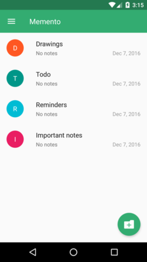
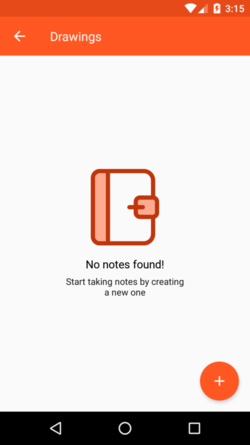
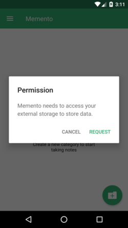
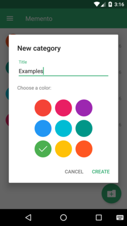
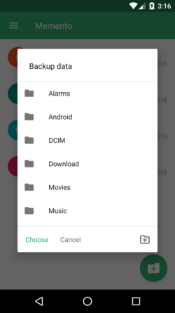
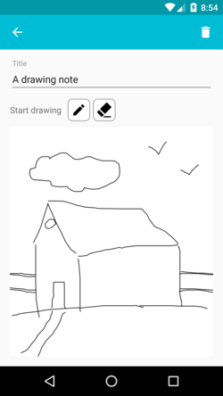

Memento
=======

A simple note taking app for Android.

## Features

- Create categories with different theme colors
- Take simple notes and make text bold or italicized
- Take drawing notes
- Backup and restore notes

## Dependencies

- **RichEditor for Android** [RichEditor for Android](https://github.com/wasabeef/richeditor-android) is a beautiful Rich Text WYSIWYG Editor for Android.
- **Material Dialogs** [Material Dialogs](https://github.com/afollestad/material-dialogs) is a beautiful, fluid, and customizable dialogs API.

## Original Sources

The source code originates from https://github.com/yaa110/Memento, which does not exist anymore.

## Screenshots

      

